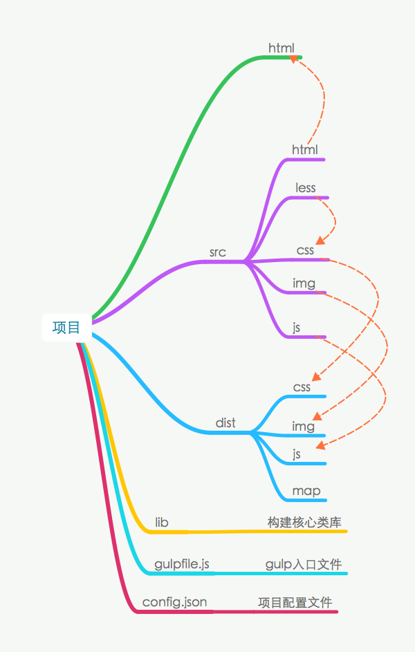
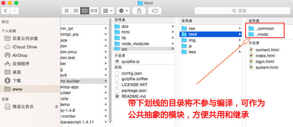
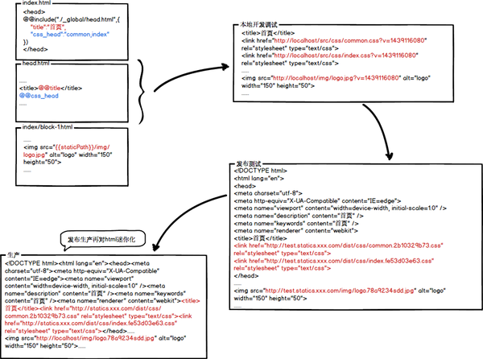
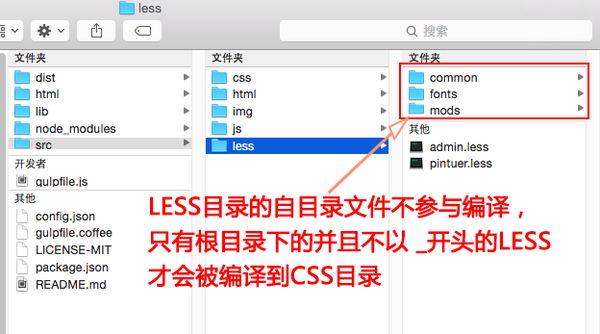
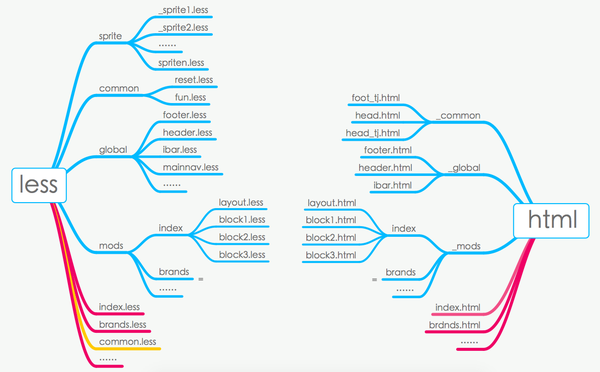

# demo-builder

这是一个静态html模块化构建方案，主要解决没有服务端语言支持的情况下，静态html文件的模块抽象问题。

## 主要功能
- 1 基于静态html的demo模块化构建方案，支持内嵌图片资源的定位功能（img带MD5戳）
- 2 基于LESS的CSS模块化构建方案（暂未包含雪碧图的自动构建功能在内）
- 3 静态CSS和JS的优化压缩，支持内嵌图片资源的定位功能，（同上）
- 4 开发状态下的watch即时编译功能，同一份源文件连续按ctrl+s保存，3秒内视为一次保存
- 5 内置一款静态开发的web服务器


## 使用




### 静态的模板语法：
```
//1，@@include包含子模板，子模板为相对路径，可以传参
//2，参数通过 @@ 来实例，当参数名字为css或js时，可以替换为html的路径引用
//3，html内嵌img可通过 {{staticPath}} 来输出路径引用，当然也可以直接相对路径
//4，在非开发状态下，html包含的 img、css和js可转化为带有md5戳的路径引用
//5，发布到CDN解决缓存和覆盖式发布问题，但这需结合后端模板，静态开发不需要

//这是主模板的内容-->
@@include("./_common/head.html",{ 
        "title":"后台管理", 
        "css":"pintuer.css,admin.css" 
    })
@@include("./_common/footer.html",{
     "js":"jquery.js,pintuer.js,respond.js,admin.js" 
})

//这是子模板的内容-->
<title>@@title</title>
<!-- css -->
@@css
<!-- /css -->
<link type="image/x-icon" href="/favicon.ico" rel="shortcut icon" />
<link href="/favicon.ico" rel="bookmark icon" />
<body>
    
    
</body>
```





### LESS编译为CSS的说明：



### 静态html模块化开发的建议：



- 1，less和html源文件尽可能碎片化；
- 2，less和html的模块最好一一对应。


## 部署
 
### 下载
```
git clone https://github.com/lmtdit/demo-builder.git
```

### 初始化
```
gulp init
```

### 开发

```
gulp 
// or 
gulp dev 
// or
gulp --e dev
```

### 发布

```
//发布到测试环境
gulp --e test

//发布到预生产环境
gulp --e pre

//发布到生产环境
gulp --e www
```

## License

MIT.